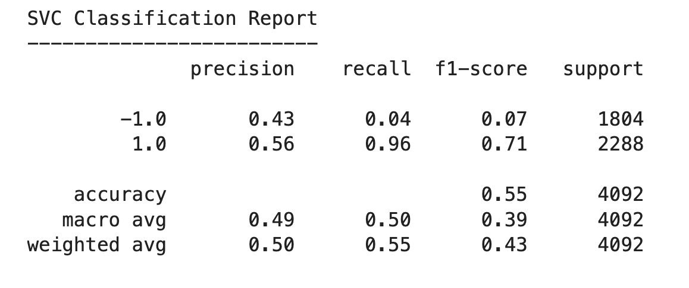

# Algorithmic-Trading-Bot
Trading Algorithm, Machine Learning Classifier

computer algorithms can buy and sell trades faster than human traders.The speed of these transactions give any firm a competitive advantage early on. But, people still need to specifically program these systems, which limits their ability to adapt to new data. For this project assuming the role of a financial advisor, I'll improve the existing algorithmic trading systems and maintain the firm’s competitive advantage in the market.To do so, I’ll enhance the existing trading signals with machine learning algorithms that can adapt to new data.I'll
create an algorithmic trading bot that learns and adapts to new data and evolving markets. To accomplish this , I'll do the following:

* Implement an algorithmic trading strategy that uses machine learning to automate the trade decisions.
* Adjust the input parameters to optimize the trading algorithm.
* Train a new machine learning model and compare its performance to that of a baseline model.

The steps for this Challenge are divided into the following sections:
* Establish a Baseline Performance
* Tune the Baseline Trading Algorithm
* Evaluate a New Machine Learning Classifier
* Create an Evaluation Report

## Technologies
This project runs on python 3.7 and includes the following libraries and dependencies:

* pandas
* Numpy
* hvplot
* sklearn
* svm
* StandardScaler
* DateOffset
* classification_report
* tree
* DecisionTreeClassifier

### Usage

To use this application on jupyter lab just clone the repository and run the **jupyterlab** by running the following command on your terminal:

```jupyterlab```

Upon launching the application  on jupyter lab run the file by clicking on the play button on top of the notebook.


---

## Results ##

### Baseline Model: Support Vector Classifier(SVC)




From the classification report we can observe that the accuracy of the model is 55%.


From The plot it is evident that tha svm model has perfomed well.It made tradiding decisions that outperformed the actual returns. Although there was a dip in the strategy return in the begining of 2020 same as the actual return but again it rose and outperformed the actual return.

### Tuned training algorithm by adjusting the size of the training dataset - SVC MODEL 1

***Impact of increasing the training window***


 By increasing the training window from 3 months to 6 months the model has improved.The return generetd by the tuned model has increased compared to the original model (1.52 vs 1.843).


### Tuned trading algorithm by adjusting the SMA input features. SVC MODEL- 2

***Impact of increasing the SMA window***


By increasing the SMA windows for short term from 4 to 5 days and for long from 100 to 120 days with the six months training window model's performance has declined from 1.845 to 1.658 compared to the adjusted SVC model 1.

### Conclusion:

By comparing the plot of original model with the adjusted models, it is evident that adjusted  training window of six months with SMA features of 4 days and 100 days that is model SVC-1 is perfoming better than the other two by producing a higher cumulative return.

### New Model: Decision Tree Classifier(DTC)

***DTC Classification Report***


The backtesting report tells us that the accuracy of this model is 45%.


Backtesting the SMA long-short trading strategy using the DTC model provides an interesting outcome. Since the begining of the period both the actual return and the strategy return are performing inversely. At the inception the strategy return was outperforming the actual return but it started showing a steep decline after first quarter of 2017 and showed a downward trend afterwards. So, it did not perform better than the original SVC model.

Again, if we compare the new DTC model with the tuned original models, still adjusted model is perfoming better with cumulative return of 1.845 vs 0.523.

### Evaluation Report:


By comparing the classification report of all the models we can observe that for the prcision all the models are yeilding the similar result for both the buying and selling class.But for the recall SVC models are good with class 1 (buying) whereas DTC model is good at predicting with class -1(selling).
Again the accuracy score for SVC models are higher that DTC model(0.56 vs 0.45).


The above visuals shows the comparison of our SVM models (original and adjusted) with the new DTC model. Notice that all the three SVC models performed better than DTC model. Comparing  the SVC models, the adjusted model with 6 months training window is surpassing other models in making trading decisions which means the SVC model 1's trading desions produced a higher cumulative return value than the other models.

In conclusion,we can say that new model DTC performed worst than the SVC models and should be tested with new testing data with adjusted parameters in order to produce better results.
